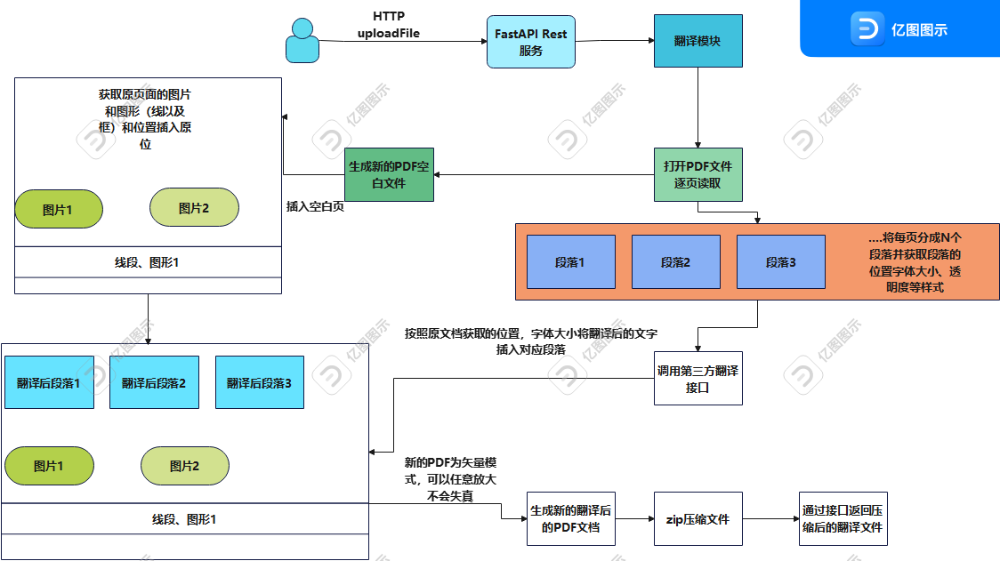

#PDF翻译者  
#项目启动方法

```bash
python3 main.py
```
##LINUX后台启动  
```bash
nohup python3 main.py >> output 2>&1 &
```
#目前对接接口  
##OpenAI  
[https://www.openai.com](https://www.openai.com)  
##有道词典  
[http://fanyi.youdao.com/openapi/](http://fanyi.youdao.com/openapi/)  
#配置项  
___所有的配置项都在seting→steing.py下___  
##OpenAi  
  ```python
class OpenAiSettings(object):    
    #openAI的completions接口地址
    Url = ""
    #openAI的Key   
    key = "" 
```
##有道词典  
  ```python

class YouDaoSettings(object):
    # 应用ID
    APP_KEY = ''
    # 应用密钥
    APP_SECRET = ''
    # 要翻译的语言
    lang_from = 'auto'
    lang_to = 'zh-CHS'
```
#运行原理  
##流程图  

##项目结构
```
│  main.py   项目入口
│  ReadMe.md 项目说明
│  requirements.txt 项目依赖信息
│  test.py 项目测试
│  
├─API 第三方API接口调用
│  ├─openai   open AI接口调用方法
│  │      AIclient.py 
│  │      
│  └─youdao 有道词典接口调用方法
│      │  TranslateDemo.py
│      │  
│      ├─utils
│      │  │  AuthV3Util.py
│      │  │  AuthV4Util.py
│      │  │  WebSocketUtil.py
├─client 翻译模块
│  │  pdfDoler.py PDF处理模块
│  │  
│  ├─fonts 字体文件
│  │      ALQSNK+LinLibertineT.pfa
│  │      BSTLLL+LinBiolinumTB.pfa
│  │      GFELSU+LinLibertineTB.pfa
│  │      simsun.ttc
│  │      XLUKDZ+LinLibertineTI.pfa
├─htmlDemo 网页测试DEMO
│      axios.min.js
│      loading.gif
│      vue.global.prod.js
│      斯坦福小镇：生成式人类行为交互模拟体.pdf
│      测试接口.html
├─seting 项目配置
│  │  seting.py
├─upload 项目上传目录
│  ├─pdf
│  ├─translated
│  └─zip
└─web WEB服务目录
    │  webServer.py
```
